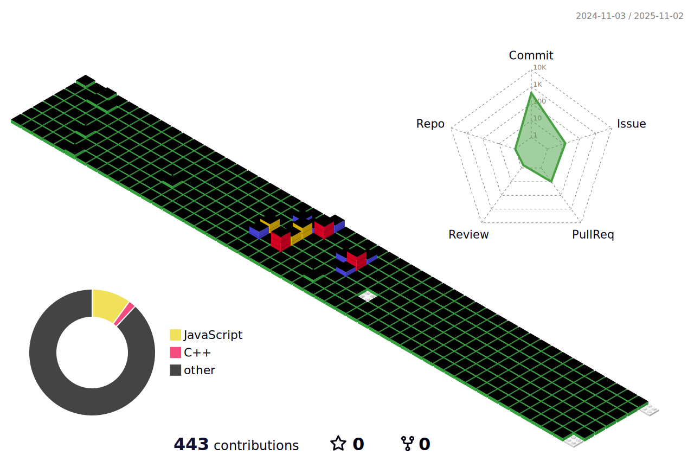

 

  

안녕하세요.
이성민입니다.

## My Skill Set  
<table><tr><td valign="top" width="33%">

### Frontend  

  
  
  
  
  
  
  

</td><td valign="top" width="33%">

### Backend  

  
  
  
  
  
  
  

</td><td valign="top" width="33%">

### DevOps  

  
  

